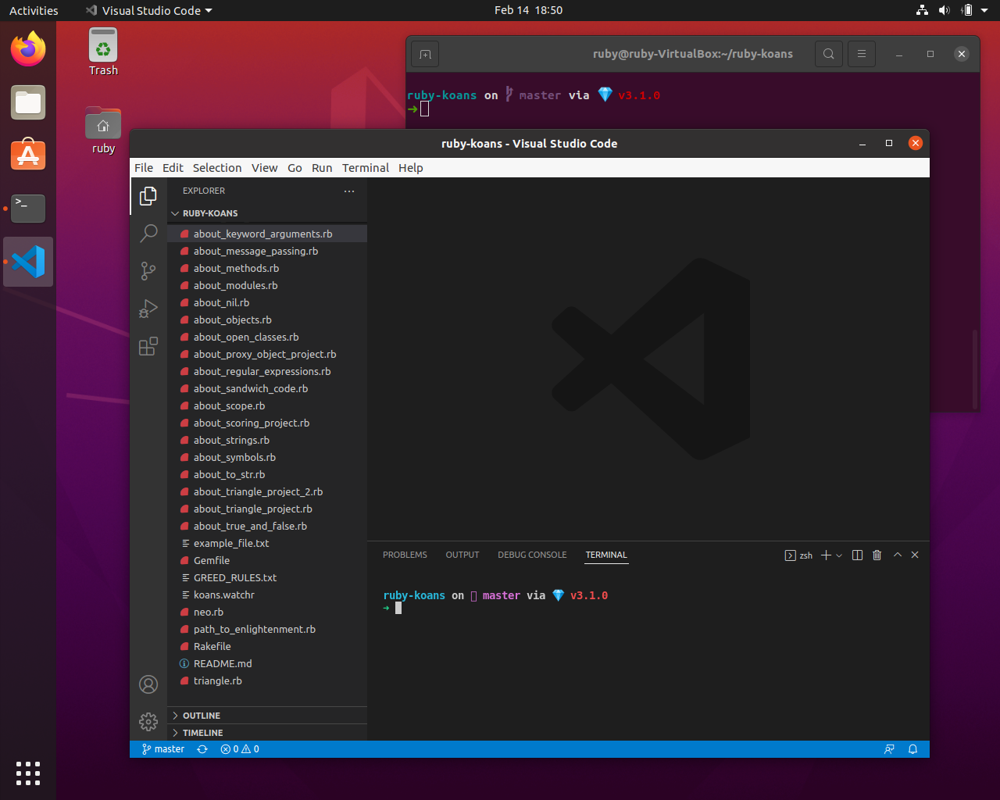

# FRS - fast Ruby setup

Automation script for spinning-up Ruby developer environment. Configure your developer stuff on Linux Ubuntu in minutes 🚀 Focus on development, not on developer tools!

## Features

* Installs & configures [git](https://git-scm.com), [git-flow](https://github.com/petervanderdoes/gitflow-avh)
* Installs & configures [ZSH](https://www.zsh.org), [OhMyZsh](https://ohmyz.sh) and [Spaceship Promt](https://spaceship-prompt.sh)
* Installs & configures [asdf](https://asdf-vm.com), [asdf Ruby plugin](https://github.com/asdf-vm/asdf-ruby)
* Installs & configures latest [MRI Ruby](https://www.ruby-lang.org/en/downloads/releases) with default gems
* Installs & configures [Visual Studio Code](https://code.visualstudio.com)

## Requirements/Preconditions

1. Fresh `Linux Ubuntu 20.04 LTS` / `Linux Ubuntu 21.10`
2. `wget` system dependency
3. GitHub personal access token

## Demo



## Using

### Get latest Ubuntu

Download and install latest [Ubuntu Desktop](https://ubuntu.com/download/desktop).

### Create GitHub personal access token

To create it go to: [`GitHub/Settings/Developer settings/Personal access tokens/New personal access token`](https://github.com/settings/tokens/new). Specify token name and next token scopes:

* `repo` - full control of private repositories
* `workflow` - update GitHub Action workflows
* `admin:repo_hook` - full control of repository hooks

### Install wget

Open your terminal. Install `wget`:

```bash
sudo apt-get install wget
```

### Download setup script

```bash
wget https://raw.githubusercontent.com/RubyWorkout/frs/master/setup.sh
```

### Allow executable permissions

```bash
chmod +x setup.sh
```

### Run script

Run Fast Ruby Setup script with your email, name (registered on github), github username and github personal access token as positional arguments:

```bash
. ./setup.sh johndoe@example.com "John Doe" git_username git_token
```

Reboot and focus on development, not on developer tools!

## Contributing

Bug reports and pull requests are welcome on GitHub at https://github.com/RubyWorkout/frs. This project is intended to be a safe, welcoming space for collaboration, and contributors are expected to adhere to the [Contributor Covenant](http://contributor-covenant.org) code of conduct. Please check the [open tickets](https://github.com/RubyWorkout/frs/issues). Be sure to follow Contributor Code of Conduct below and our [Contributing Guidelines](CONTRIBUTING.md).

## License

The gem is available as open source under the terms of the [MIT License](https://opensource.org/licenses/MIT).

## Code of Conduct

Everyone interacting in the FRS project’s codebases, issue trackers, chat rooms and mailing lists is expected to follow the [code of conduct](CODE_OF_CONDUCT.md).

## Credits

- [The Contributors](https://github.com/RubyWorkout/frs/graphs/contributors) for code and awesome suggestions
- [The Stargazers](https://github.com/RubyWorkout/frs/stargazers) for showing their support

## Versioning

FRS uses [Semantic Versioning 2.0.0](https://semver.org)
